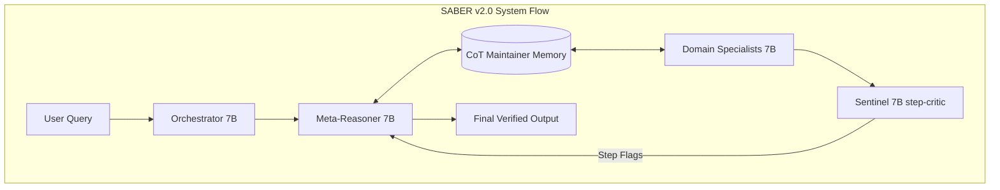

# SABER v2.0: Stateful Multi-Agent Mixture-of-Experts System

SABER (Stateful Agentic Boundary Evaluation & Reasoning) is an on-premise, stateful Multi-Agent Mixture-of-Experts (MoE) reasoning architecture designed for highly reliable, multi-step domain reasoning. By leveraging specialized 7B parameters neural network experts, an external working memory manager, and a real-time step-level verification critic, SABER maintains logical consistency over long deduction chains and prevents reasoning propagation errors.

---

## Architecture Diagram



---

## Core Components

### 1. Orchestrator (7B)
The entry point routing engine. It parses the incoming query and performs soft classification to activate one or more domain-specific specialists. It is trained on adversarial hard-negatives to prevent mis-routing on domain boundaries (e.g. routing financial health queries containing medical terminology to the Finance expert).

### 2. CoT Maintainer
An external stateful working memory block that specialists read from and write to during processing.
* **`ReasoningStep`**: Tracks action type (`IDENTIFY`, `ANALYZE`, `HYPOTHESIZE`, `EVIDENCE`, `EVALUATE`, `CONCLUDE`), content, and confidence.
* **`CoTChain`**: Tracks reasoning steps, overall chain confidence, and completeness flags.
* **Cleanup Pipeline:** Prunes steps with $>85\%$ similarity, detects and prevents infinite reasoning loops, and merges consecutive steps of the same action type to compress context window usage.

### 3. Domain Specialists (7B)
A suite of 6 fine-tuned expert models operating on a `Qwen2.5-7B` base:
* **Medical Specialist:** Clinical diagnostics, USMLE reasoning, and healthcare magic.
* **Science Specialist:** Physical equations, thermodynamic calculations, and biology.
* **Cybersecurity Specialist:** Malware analysis, incident response, and network forensics.
* **Coding Specialist:** Dynamic programming, syntax correction, and refactoring.
* **Architecture Specialist:** Distributed system design, cloud migrations, and zero-trust.
* **Finance Specialist:** Technical chart analysis and option valuation models.

### 4. Sentinel Step-Critic
A real-time verification kernel that intercepts reasoning steps during generation. It evaluates step-level logical consistency against prior context, flags sudden confidence drops ($>0.3$), and enforces structural execution boundaries.

### 5. Meta-Reasoner (7B)
The system's compiler. It synthesizes the specialists' reasoning steps into a single verified answer. If the Sentinel flags a logic error, the Meta-Reasoner dynamically generates correction patches to rewrite the flawed step.

---

## Training Dataset

SABER v2.0 is trained on a highly sanitized, deduplicated corpus containing **128,000 records**:

* **Medical (18,000):** MedQA USMLE, WikiDoc, ChatDoctor.
* **Science (20,000):** ScienceQA, SciQ, MathInstruct.
* **Cyber (22,000):** MITRE ATT&CK STIX, Infosec QA, Trendyol.
* **Coding (25,000):** CodeFeedback Filtered.
* **Architecture (17,000):** Software-Architecture and procedurally generated templates.
* **Finance (15,000):** Finance Alpaca, Synthetic Chart Analysis.
* **Orchestrator (5,500):** Dolly-15K, Natural Instructions, 500 boundary hard-negatives.
* **Meta-Reasoner (6,000):** UltraFeedback, Conflict Resolution, CoT Eval.

*Note: ~30% of eligible dataset records are formatted into structured `## Step X [ACTION]` sequences to train the models to reason step-by-step natively.*

---

## Hyperparameters (B200 GPU Optimized)

| Hyperparameter | Value |
| :--- | :--- |
| **Base Model** | `Qwen/Qwen2.5-7B-Instruct` |
| **Precision** | `Bfloat16` |
| **Batch Size** | `16` |
| **Sequence Length** | `2048` |
| **Learning Rate** | `2e-4` |
| **LoRA Rank / Alpha** | `16 / 32` |
| **Training Schedule** | Domain Specialists (3 epochs), Meta-Reasoner (6 epochs), Orchestrator (8 epochs) |

---

## Setup & Execution

### 1. Installation
Install all required dependencies:
```bash
pip install -r requirements.txt
```

### 2. Run the Complete Pipeline
To automatically download and prepare the CoT datasets, format them, and launch the sequential training run on GPU 0, execute:
```bash
./run.sh
```

### 3. Monitoring
Logs for individual training domains are outputted in real-time to the screen and saved under:
```
logs/train_[domain].log
```
To tail a log in the background:
```bash
tail -f logs/train_medical.log
```
